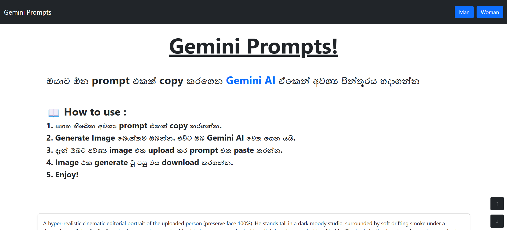
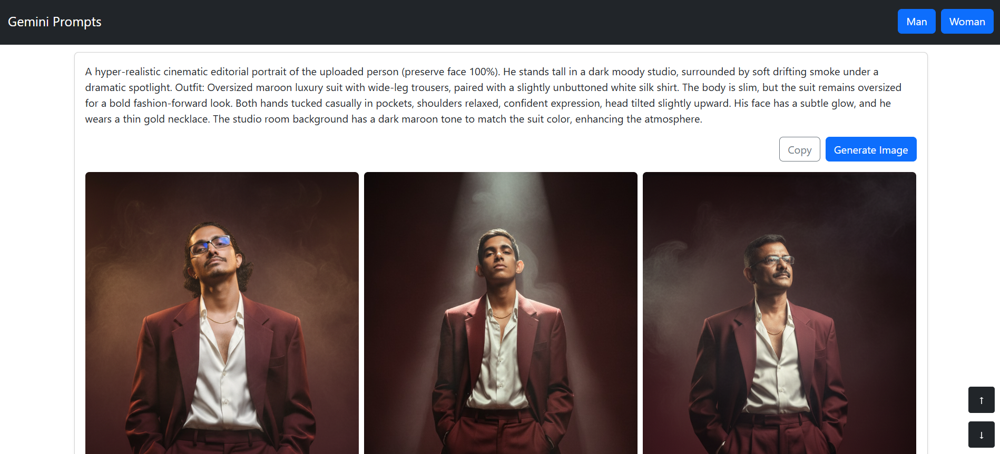
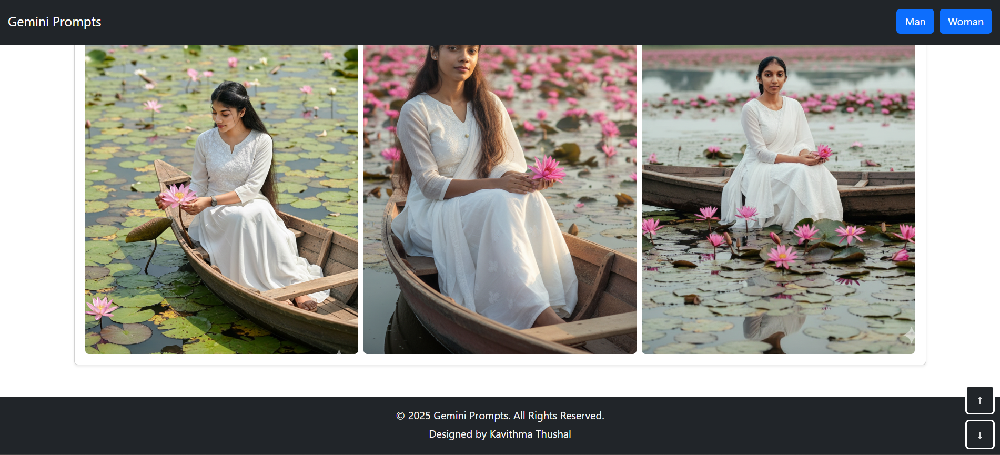
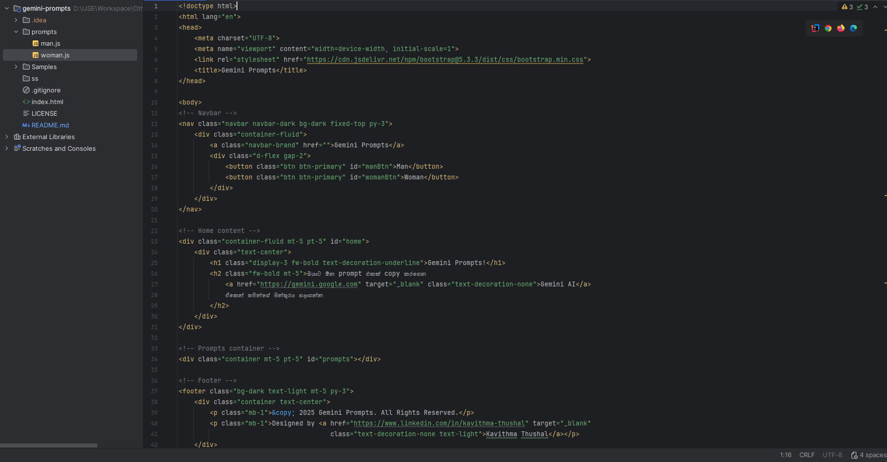

# 🌟 Gemini Prompts 🌟

Discover a simple yet creative web application built with **HTML** and **CSS** to manage and showcase AI prompts. With
this project, users can generate images using prompts directly through the website.

## 🛠️ Technologies

✅ **HTML**  
✅ **CSS**  
✅ **Bootstrap**  

## 🚀 Features

✅ **Lightweight Design**: Built with only HTML and CSS—no frameworks needed.  
✅ **Responsive UI**: A clean interface that adapts to different screen sizes.  
✅ **Image Generation Support**: Use prompts to create AI-generated images.  

## 📖 How to use

1. Go to this web page `https://kavithma-thushal.github.io/gemini-prompts`
2. Copy any prompt you like.
3. Click the `Generate Image` button, it will redirect you to `Gemini AI`.
4. Upload your image and paste the copied prompt.
5. Download the generated image.
6. Enjoy!

## 📸 Screenshots

## 📝 Version

**1.0.0**

## 📬 Get in Touch

Got any bugs, ideas, or improvements? I’d love to hear from you!

📧 [kavithmathushal9007@gmail.com](mailto:kavithmathushal9007@gmail.com)

#### This project is licensed under the [Apache License](LICENSE)

#### © 2025 All Rights Reserved | Designed by [Kavithma Thushal](https://github.com/Kavithma-Thushal)

